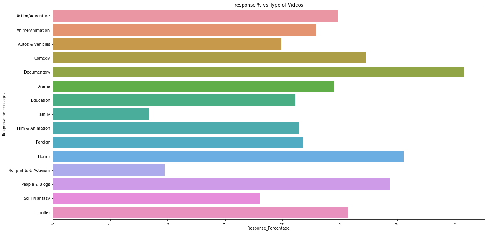

## What Makes Youtube Videos Viral

## Executive Summary
There are many social media platforms like TikTok, Snapchat, YouTube, and Instagram, to mention a few, which are used today by content creators to share their perspectives and knowledge. This project aims to extract information from features such as comments, hashtags, likes, and views of YouTube and perform serval analysis to investigate what makes videos viral on this social media platform. View count, how quickly the footage generates views, where the views are coming from, the age of the video, and how well the footage performs compared to other recent uploads are some signals considered for a trend to occur.

Many content creators and users of YouTube have wondered if uploading videos on specific days or times, using all caps in their titles, or having lengthy descriptions affects the reaction of their content. Still, they have not analyzed readily available data on the platform to draw valuable insight. Conclusions drawn from this research can help content creators and businesses improve upon their services and generate revenue.

## Statement of Scope
We would accomplish this project using data from Kaggle and not just one country but several countries with video trending. We would run the analysis using Python and R and produce multiple regression analysis and sentiment analysis.

## Project Schedule
The project schedule was created using a Gantt chart. This chart shows the timelines, the different tasks to be performed and the team members responsible for each task. [Link to Gantt Chart](https://github.com/msis5223-pds2-2022spring/msis-5223-deliverable-1-white-walkers/blob/main/assets/project_schedule.xlsx)

## Data Preparation
The dataset collected from Kaggle was further cleaned to drop some unnecessary columns for our analysis. The categories of each video were extracted from a separate json file using regular expression and then fetched with the primary data set. The datasets were divided into four subsets to ease the analysis process. Some additional columns not part of the original dataset was derived and included in the relevant datasets.

Link to data:
* [cleaned_yt_us](data/cleaned_yt_us.csv) The final dataset generated for this project
* [yt_data_usa_channel_analysis.csv](data/yt_data_usa_channel_analysis.csv) The final subset generated for this project
* [yt_data_usa_view_analysis.csv](data/yt_data_usa_view_analysis.csv) The final subset generated for this project
* [yt_data_usa_first_views.csv](data/yt_data_usa_first_views.csv) The final subset generated for this project
* [yt_data_usa_final_views.csv](data/yt_data_usa_final_views.csv) The final subset generated for this project
* [data_processing.ipynb](code/data_processing.ipynb) Python file used to clean, consolidate, and transform the data from website *kaggle.com*

### Data Access
This dataset contains data on the most popular YouTube videos in the United States from 2020-08-03 to 2021-07-05. The dataset covers the most recent information on the video title, channel title, publish time, tags, views, likes and dislikes, description, and comment count. The information is intended for an English-speaking audience. Non-ASCII and non-Latin characters, in particular, have been deleted from the text fields. Datasets also include a json file with the category id of each video.

Acknowledgments: This dataset is the updated version of Trending YouTube Video Statistics from Kaggle ("https://www.kaggle.com/rsrishav/youtube-trending-video-dataset?select=cleaned_yt_us.csv"). It was originally collected using the YouTube API.

### Data Cleaning
The original data on trending videos were already cleaned, so we currently have not performed any cleaning. However, we dropped few columns such as "channelId", "thumbnail_link", "ratings_disabled", "comments_disabled", "description" and "tags" from the data set as they were not necessary for our analysis.

Some cleaning steps were performed to the json file [data\US_category_id.json] as well to extract the categories of the videos using regular expression. The steps to cleaning can be found in the data_processing.ipynb script [code\data_processing.ipynb].

### Data Transformation
No numerical transformation were performed into the data to preserve the original information. However, following steps were taken to create some new metrices from the original data:

1. Once the data set was cleaned [data\cleaned_yt_us.csv], it was divided into two subsets df_firstViews and df_finalViews because the same video can be presented in the dataset multiple times as the video can stay trending for many consecutive days. While the former dataset includes the information on the video when it first appeared on youtube, the latter considers the final number of views, likes, and other attributes once the videos became trending.

2. Few derived metrices were created from the numerical data to develop a deeper analysis of the data. The following equations dictate how we transformed the numerical attributes to create the derived columns: -Response percentage=100*(like+dislikes)/total view -Likes percentage=100*(likes)/total view -Dislikes percentage=100*(dislikes)/total view -Comments percentage=100*(comments)/total view

3. In addition, the number of days in trending were calculated by counting the total appearance of a particular video in the dataset.

### Data Reduction
The main dataset was divided into four small subsets. The views of the videos grouped by their categories are listed in [view_analysis_data] (data/yt_data_usa_view_analysis.csv). The [Channel_Analysis_data] (data/yt_data_usa_channel_analysis.csv) contains the views of the videos grouped by their channel name. The [FinalViews_dataset] (data/yt_data_usa_final_views.csv) contain information on the video when it first appeared on youtube, while the [FirstViews] (data/yt_data_usa_first_views.csv) considers the final number of views, likes, and other attributes once the videos become trending. Each dataset also contains the four derived columns (e.g., Response percentage, Likes percentage, Dislikes percentage, and Comments percentage).

### Data Consolidation
To consolidate the data the categories of each video were extracted from the JSON file and fetched with the main dataset and four subsets.

### Data Dictionary
A short description of the table below. Be sure to link each row to a data file in your directory `data` so I know where it is stored.

| Attribute Name | Description | Data Type | Source | Data | Example |
|:---|:---|:---:|:---|:---|:---:|
| Video_id | Unique identifier for a video | characters | http://www.youtube.com | [cleaned_yt_us.csv](data/cleaned_yt_us.csv)
| title | Title of the video | varchar() | http://www.youtube.com | [cleaned_yt_us.csv](data/cleaned_yt_us.csv) 
| publishedAt | Date/Time of the video published | DateTime | http://www.youtube.com | [cleaned_yt_us.csv](data/cleaned_yt_us.csv) 
| channelId | Unique identifier for the channel | varchar() | http://www.youtube.com | [cleaned_yt_us.csv](data/cleaned_yt_us.csv) 
| channelTitle | Title of the channel | varchar() | http://www.youtube.com | [cleaned_yt_us.csv](data/cleaned_yt_us.csv) 
| categoryId | Unique identifier for the category of each videos | int | http://www.youtube.com | [cleaned_yt_us.csv](data/cleaned_yt_us.csv) 
| trending_date | Date/Time of the video became trending | DateTime | http://www.youtube.com | [cleaned_yt_us.csv](data/cleaned_yt_us.csv) 
| view_count | number of views each videos received | int | http://www.youtube.com | [cleaned_yt_us.csv](data/cleaned_yt_us.csv) 
| likes | number of likes each videos received | int | http://www.youtube.com | [cleaned_yt_us.csv](data/cleaned_yt_us.csv) 
| dislikes | number of dislikes each videos received | int | http://www.youtube.com | [cleaned_yt_us.csv](data/cleaned_yt_us.csv) 
| comment_count | count of comments each videos received | int | http://www.youtube.com | [cleaned_yt_us.csv](data/cleaned_yt_us.csv) 
| Video_Category | Category of each videos | int | http://www.youtube.com | [cleaned_yt_us.csv](data/cleaned_yt_us.csv) 
| Response_Percentage | 100*(no. of likes+no. of dislikes)/total number of views | decimal | http://www.youtube.com | [yt_data_usa_view_analysis.csv](data\yt_data_usa_view_analysis.csv) 
| LikesPercentage | 100*(no. of likes)/total number of views | decimal | http://www.youtube.com | [yt_data_usa_view_analysis.csv](data/yt_data_usa_view_analysis.csv) 
| DisikesPercentage | 100*(no. of dislikes)/total number of views | decimal | http://www.youtube.com | [yt_data_usa_view_analysis.csv](data/yt_data_usa_view_analysis.csv)
| CommentsPercentage | 100*(no. of dislikes)/total number of views | decimal | http://www.youtube.com | [yt_data_usa_view_analysis.csv](data/yt_data_usa_view_analysis.csv)
| times_in_trending | Total no. of days since the video remained trending | int | http://www.youtube.com | [yt_data_usa_final_views.csv](data/yt_data_usa_final_views.csv)

### Unit of Analysis
The unit of analysis for this project would be the number of likes, dislikes, comments, and views each video recieved. Additionally, few calculated metrices such as response percentage, comments percentange, likes percentages, etc. will be used to get indepth understanding on the overall impression each videos create on the viewers. 

### Descriptive Statistics and Analysis
Descriptive statistics was performed on the dataset to provide the basic information about the variables and to initially identify the potential relationships between the variables. The table below shows the measures of central tendency of the numerical columns in the dataset.

## Measures of Central Tendencies
| Columns/Stats | Mean | Median | Standard Dev. | Max value | Min value
|:---|:---|:---:|:---|:---|:---:|
| view_count | 2.852040e+06 | 1167916.0 | 6.610673e+06 | 264407389 | 0
| likes | 1.538462e+05 | 54442.0 | 4.193916e+05 | 16021534 | 0
| dislikes | 3.366857e+03 | 923.0 | 1.445148e+04 | 879354 | 0
| Comment_count | 1.548456e+04 | 4373.0 | 1.091277e+05 | 6738537 | 0

## Judgement Metrics for YouTube Video

## Like Ratio: If a like_ratio is more than 0.9, it means the video is likable for the viewers.
# Like_ratio = likes / (likes+dislikes)

There are 35510 videos that have a likes ratio greater than 0.9 (Called “Highly Liked”), 1908 videos which have a likes ratio between 0.1 and 0.9 (Called “Moderately Liked”), and rest of the videos as “Highly Disliked”. The video title with the highest liked ratio is “my city is covered in garbage” (Channel title: Ash Kabosu), and the video with the lowest liked ratio is “Cuties | Official Trailer | Netflix” (Channel Title: Netflix)

## Engagement of video: Comments should be 0.5% of total views
# Comment views ratio = count of comments/ no of views

There are 17 videos with high engagements as they have comments views ratio greater than 0.05. The video with the most engagements is “12 iPhone 12 For You - Celebrating 5 Years Of..” (Channel Title: Technical Guruji) and 154 videos without any comment.

##	Likes to Views: Likes should be 4% of views or more to be popular
## Likes Views ratio = Likes/No of views

There are 14631 videos with high popularity, the most popular one being “Stray Kids Scars Music Video Unit Teaser” and the least popular is “Kim Kardashian's Must-See Moments on”

### Public Engagements in Different Categories of Videos
All the videos uploaded are categorized to 14 Types. Out of all, People & Blogs and Drama has the highest view count, followed by Action/Adventure.

However, view count does only give a surface level understanding of how popular a video could be, because people might have just viewed the video to give it a dislike. Visualizing the count of likes, and dislikes among different categories might give more understanding on which categories of videos people like and dislike the most.  

Similar to the observation for views, it looks like People & Blogs, Drama, and Action/Adventure- these three categories outnumber other categories in count of likes and dislikes. This makes sense as a video can go viral in both positive and negative sense. Therefore we created another metric called response percentage that includes both the number of likes and dislikes and normalized it with the number of views. This will dictate how engaging the videos are to the viewers. 

Doumentary, Horror, and People & blogs are the three categories with highest response percentage. 

People tend to comment more over People & blogs category videos.

## Total number of times in trending

Videos fron Nonprofits & Activism stays on average 35 to 20 days in trending, which is the maximum among different categories. In contrast, Horror type videos are the ones with the least number of trending days.

Channels related to sports tend to stay higher amount of time in trending compared to other types. NBA, NFL, and MrBeast Gaming are the three channels with videos being viral for the maximum days. 

We also wanted to see how many days it takes for different categories of video to be in trending since their first appearance on youtube. The following figure shows average number of days took to be in trending for the videos from different categories.

## Text and Sentiment Analysis
We went ahead to perform some text analysis on the title that were used on these viral videos to identify if there was an indentifiable format or a trend to the choice of the titles. \
The first step of this procedure was to breakdown the titles into the character lengths.

This was to help identify if there was a specific range in which most of the viral videos tend to use as title for a better engagement count. For this particular list of viral youtube videos, the characters with the highest count were in the ranges of 38 to 50 characters for the video titles. This was not evident information of the video being the best out there since, the counts chart did not reflect the engagements for the videos but it helped breakdown the character ranges of the viral videos. Anything below 20 characters and above 80 characters on the list do not have the most appearances in the viral list.

Since this did not quantify whether the videos would trend or not, we went ahead to perform text mining on the titles to pick out the most used words in the videos list. For that we performed text analysis on the title text data. We used this to extract insights from the unstructured title text data to quickly digest information and transform them into actionable insights.
The image below shows the top count for the most used words in a tabular and a chart format to understand the weighted differences between the terms used. \

From the represented images the top 5 most occuring words in the list were official, video, vs, music, highlights. The wordcloud shown below is another representation of the most used words. \

The other words on this list in summation also gave the impression that the most used words as stated earlier could be related to sports channels with the use of 'vs', 'video' and 'highlights'. Music videos also were presumably featured on this list with the words as 'music', 'video', 'official', 'ft'. There was a relation to gaming as well being in the light of 'minecraft', 'game' and 'trailer'. \
We noticed that some of the words most frequently occuring had a lot of similarities with each other in the concept of the groups in which they belong. Therefore, as an addition we made bigrams and trigrams to further understand these relations and attach convincingly the words that were most used together in groups of twos and threes. \

 \
The bigrams and trigrams together show that the most viral videos come from the words 'official music video' which was significantly marginaly higher than the other groups of words, followed by 'full game highlights' which was sports based, 'friday night funkin' and 'week highlight nfl'. These categories of videos tallied with the descriptive information that were provided showing the most occuring videos in the list.
\
Lastly for the sentiment analysis, we attached sentiment scores to all the titles using a sentiment emotion classifier to identify the sentiments that had the most overall likes. \

The sentiment with the highest number of likes was positive, then trust and not surprisingly, we have negative sentiments. We were led to believe, as stated before that videos could and would go viral for positive and negative reasons.

## Predictive Modelling
In this section, we mainly used multiple regression in answering the questions: which variables were essential to view count and the factors necessary in determining the total number of days a video remained trending. 

From the regression model displayed below,it was evident that the variables likes, dislikes, comments, response_percentage, likespercentage, dislikepercentage and engagement were essential to view count. These variables had p-values less than 0.05. Comments percentage and channel wordcount don't seem to play an important factor in determining the views of a video.  \

The variables, comment_count and view_count were found to be vital in determing the total number of days a video remained trending as indicated by the regression model below. 

## Conclusion and Discussion
The research discovered the factors needed to make a YouTube video go viral. Kaggle was the source of the data. Critical variables examined included: the title of the video, date or time of the published video, the identifier for the channel, the title of the channel, the category of each video, the date or time the video became trending, the number of views, likes and dislikes each video received, count of comments, the response, likes, dislikes, and comment percentage. The total number of days the video remained trending. 

Analyzing the uploaded categories, People & Blogs and Drama had the highest view count, followed by Action/Adventure. Having a high view count was associated with having a high like or dislike count. 

In observing the categories of videos and the number of comments received by each, viewers commented the most on the same categories with the highest view counts (that is, people and blogs, drama, and action categories) 

We found the family category to have the highest number of days in trending and the horror category with the least trending days. Exploring which channels had a high amount of trending, media relating to sports had a better chance.

The title of the videos was next to be analyzed using text and sentiment analysis. This analysis indicated that viral videos had titles with counts between 20 and 80 characters or words. An analysis of specific terms used in titles revealed that videos with the words, official, video, vs., music, highlights, and combinations of words, 'official music video,' 'full game highlights,' 'Friday night funkin', and 'week highlight NFL, mostly went viral. There were positive, trust, and negative words from the sentiment analysis.

Finally, the regression models developed showed the variables: likes, dislikes, comments, response_percentage, like_percentage, dislike_percentage, and engagement were essential to view count. The factors:  comment_count and view_count 
were crucial in determining the total number of days a video remained trending. 

The findings from this research study can help influencers, businesses, and people seeking to make an impact through Youtube in deciding on: the category their videos should fall under, the words to be used in their selection of titles, the average length of titles, and how many days they should expect their videos to remain trending.
